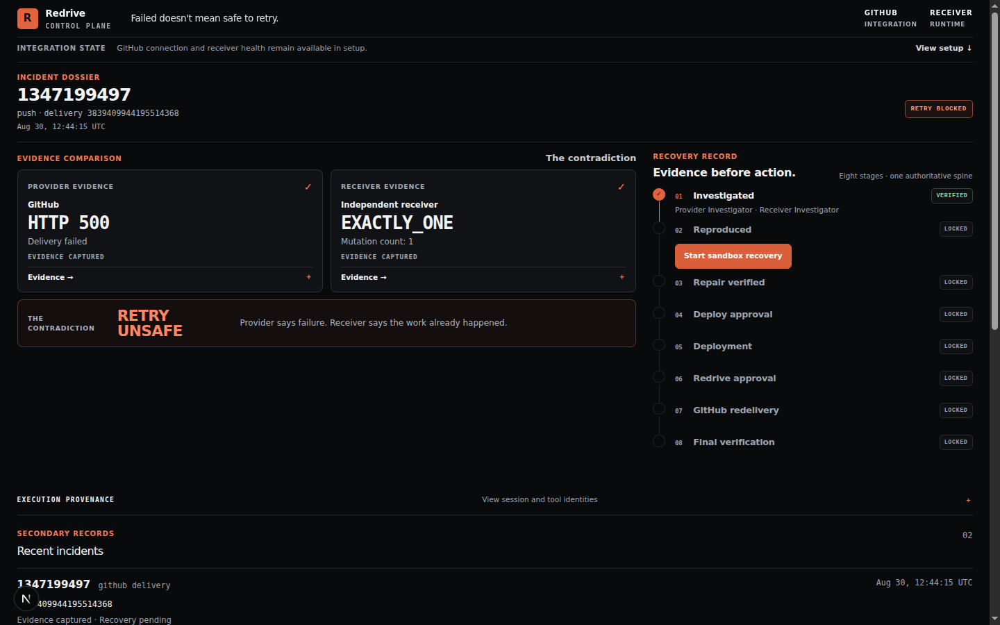
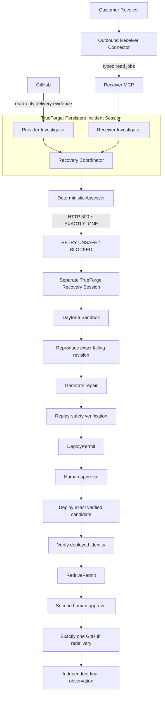

# Redrive

> ## Failed doesn't mean safe to retry.

Redrive is a recovery control plane for ambiguous webhook failures.

When GitHub says a delivery failed, Redrive does not assume retrying is safe. It checks what GitHub observed, checks what the receiver actually did, compares the two using deterministic code, and blocks replay when the facts do not line up.

If recovery is needed, Redrive reproduces the failure at the exact failing revision in an isolated sandbox, generates a repair, verifies that repair against the business invariant, and puts deployment and redelivery behind separate human approvals.

**[Watch the demo](https://youtu.be/DMn5PX3MuEs)** · **[Demo receiver](https://github.com/Redrive-Labs/redrive-demo-receiver)** · **[Architecture](docs/ARCHITECTURE.md)**



---

## Why this exists

A webhook returning `500` does not mean nothing happened.

Consider a receiver that:

1. writes the business event to its database;
2. calls another service;
3. that downstream call fails;
4. the webhook handler returns `500`.

GitHub sees this:

```text
HTTP 500
```

The receiver may already be here:

```text
mutationCount = 1
businessState = EXACTLY_ONE
```

Retrying without checking can turn one successful business mutation into two.

That is the problem Redrive is built around.

> **No proof, no retry.**

---

## The incident Redrive investigates

Our canonical failure looks like this:

```text
GitHub
HTTP 500
    │
    ├──────────────┐
    │              │
    ▼              ▼
Provider        Receiver
Investigator    Investigator
    │              │
HTTP 500       EXACTLY_ONE
    │              │
    └──────┬───────┘
           ▼
    deterministic
      comparison
           │
           ▼
PROVIDER_FAILED_RECEIVER_MUTATED
           │
           ▼
       RETRY UNSAFE
           │
           ▼
         BLOCKED
```

GitHub says the delivery failed.

The receiver independently proves the business mutation already exists.

Redrive does not ask an LLM whether that "sounds dangerous." The contradiction comes from deterministic application code.

Only after that contradiction is established does recovery begin.

```text
exact failing revision
        ↓
isolated Daytona sandbox
        ↓
reproduce the failure
        ↓
generate repair
        ↓
verify replay safety
        ↓
DeployPermit
        ↓
human approval
        ↓
deploy + verify
        ↓
RedrivePermit
        ↓
second human approval
        ↓
exactly one GitHub redelivery
        ↓
independent final proof
```

---

# What Redrive does differently

Most incident agents start from a failure and immediately move toward remediation.

Redrive spends more time answering a harder question first:

**What actually happened?**

| Question | Redrive |
|---|---|
| GitHub returned `500`. Should we retry? | Not until receiver state is known. |
| Who decides whether the evidence conflicts? | Deterministic Redrive code. |
| Can the agent query production however it wants? | No. It gets narrow, typed evidence capabilities. |
| Does generating a patch count as fixing the incident? | No. The failure must be reproduced and the repair verified. |
| Is a successful HTTP response enough after replay? | No. Business state must also remain correct. |
| Can the repair agent deploy its own patch? | No. Deployment needs a separate permit and human approval. |
| Does deployment approval also authorize redelivery? | No. Redelivery has its own permit and approval. |
| What happens if a consequential action has an ambiguous result? | Redrive stops instead of blindly repeating it. |

The system has a simple division of responsibility:

> **AI reasons. Integrations observe. Deterministic code proves. Humans authorize.**

---

# TrueForge is the runtime, not a wrapper

TrueForge is not sitting beside Redrive as a chat interface.

It runs the agent side of the system.

Redrive uses TrueForge for persistent incident sessions, dynamic investigators, MCP execution, Skills, persisted tool provenance, and the separate recovery workflow.

| TrueForge capability | What Redrive uses it for |
|---|---|
| **Persistent sessions** | One incident-bound Coordinator session survives across investigation turns and Redrive restarts. |
| **Dynamic subagents** | The Coordinator creates specialized Provider and Receiver Investigators when needed. |
| **MCP tools** | Investigators read real GitHub and receiver evidence through narrow interfaces. |
| **Skills** | Investigation procedures live as versioned git-backed TrueForge Skills. |
| **Persisted events** | Redrive can trace the child thread, MCP call, tool response, turn, and session that produced evidence. |
| **Sandbox support** | Skills and recovery work run without handing production credentials to generated code. |
| **Separate Recovery Session** | Repair work is isolated from the persistent investigation session. |
| **Execution provenance** | TrueForge session and turn identities are stored and surfaced in the cockpit. |

One design choice matters a lot here.

Redrive does not treat agent prose as evidence.

The path looks like this:

```text
dynamic investigator
        ↓
specific MCP tool call
        ↓
correlated TrueForge tool.response
        ↓
strict deterministic parser
        ↓
durable evidence
```

If the expected child thread, MCP server, tool call, arguments, or response cannot be correlated correctly, Redrive fails the investigation.

The model cannot talk its way around that boundary.

---

# Architecture



The important part is not the number of agents.

It is where trust changes hands.

---

# Two independent views of the same failure

The provider and receiver investigators do not derive their answers from the same source.

That separation is intentional.

## Provider side

GitHub evidence is exposed through a narrow Redrive-owned MCP operation:

```text
get_webhook_delivery(connection_id, delivery_id)
```

The `connection_id` resolves the persisted GitHub App installation, repository, and webhook binding inside Redrive.

The model does not get to construct arbitrary repository names, webhook IDs, API URLs, or credentials.

It asks for one delivery through one already-bound application connection.

---

## Receiver side

Receiver truth comes through a separate outbound connector.

```text
Redrive
   │
   │ durable typed read job
   ▼
Receiver Connector
   │
   │ fixed local adapter
   ▼
Customer system
```

The initial evidence surface is deliberately small:

```text
get_business_state(connection_id, delivery_guid)
get_receiver_health(connection_id)
```

The connector does not expose generic capabilities such as:

```text
sql_query(...)
shell(...)
ssh_exec(...)
arbitrary_url(...)
```

The receiver's database and runtime credentials stay inside the receiver environment.

They are not passed into model context, Redrive's MCP payloads, or Daytona.

In our live receiver validation, this path returned:

```text
mutationCount = 1
businessState = EXACTLY_ONE
```

The underlying business row count stayed unchanged while Redrive observed it:

```text
PRE   = 1
POST  = 1
FINAL = 1
```

The observation path itself did not mutate the business state.

---

# The contradiction is deterministic

The investigators collect facts.

They do not decide what those facts mean.

Redrive's assessor does that.

```text
provider failed
+
receiver mutationCount >= 1
=
PROVIDER_FAILED_RECEIVER_MUTATED
```

For the canonical incident:

```text
Provider:
  HTTP 500

Receiver:
  mutationCount = 1
  EXACTLY_ONE

Result:
  PROVIDER_FAILED_RECEIVER_MUTATED

Recovery:
  BLOCKED
```

This is the point where Redrive proves that blind replay is unsafe.

Nothing has been repaired yet.

Nothing has been deployed.

Nothing has been redelivered.

The system has simply established enough reality to know that a retry would be irresponsible.

---

# Reproducing the real failure

Recovery happens in a separate TrueForge session backed by Daytona.

The recovery agent starts from the exact failing Git revision:

```text
5bfadf93d5233e4e6cfe0fdb19ad1b78328a5d79
```

Before changing anything, it has to reproduce the failure.

The observed sandbox sequence was:

```text
0 → HTTP 500 → 1
```

In other words:

```text
mutation count = 0
        ↓
send delivery
        ↓
HTTP 500
        ↓
mutation count = 1
```

That reproduces the exact shape of the incident.

The transport failed, but the business mutation happened.

---

# What was actually broken

The demo receiver first persisted the event, then called a downstream service.

The downstream contract expected:

```text
eventId
deliveryId
```

The receiver supplied the wrong delivery field.

That downstream call failed after the database write had already completed.

The webhook therefore returned `500` even though the business event existed.

The recovery agent found that failure in the sandbox and produced a repair there.

It was not handed a pre-written patch.

---

# A patch is not proof

Generating code is the easy part.

Redrive does not consider a candidate safe until the same logical delivery is tested against the already-mutated state.

After the repair, the observed sequence became:

```text
1 → HTTP 201 → 1
```

Expanded:

```text
mutation count = 1
        ↓
same logical delivery
        ↓
HTTP 201
        ↓
mutation count = 1
```

The request succeeds, and the business mutation still exists exactly once.

The accepted recovery artifact recorded:

```text
State:
REPAIR_VERIFIED

Reproduction:
0 → HTTP 500 → 1

Verification:
1 → HTTP 201 → 1

Patch SHA-256:
6496e9635406f56d19f08bab431ceda87005ea32d543375aade59d84ee960a39
```

Calling the recovery path again returned the same durable artifact, accepted TrueForge turn, and patch SHA instead of silently generating another candidate.

---

# Recovery and authorization are separate concerns

A verified repair still does not get permission to touch production.

Redrive has two consequential boundaries.

## DeployPermit

A DeployPermit authorizes one exact verified repair against one exact recovery state.

The permit is bound to the candidate and current state.

If relevant state changes, the previous approval is no longer enough.

## RedrivePermit

Deployment approval does not grant permission to replay the webhook.

Redrive first verifies the deployed receiver.

Only then can it produce a separate RedrivePermit for the original delivery.

That permit authorizes one redelivery.

So the sequence is:

```text
repair verified
    ↓
DeployPermit
    ↓
human approval
    ↓
deploy
    ↓
verify deployment
    ↓
RedrivePermit
    ↓
second human approval
    ↓
one redelivery
```

These are two different decisions because they carry two different risks.

---

# The live run where Redrive refused to guess

One of the most useful validation results was not a clean success.

After the single permitted GitHub redelivery in our final live test, the external route returned:

```text
HTTP 504
```

That leaves the outcome ambiguous.

A less conservative recovery system might retry.

Redrive did not.

It preserved the ambiguity and refused to issue another blind redelivery because it could no longer prove the result of the previous consequential action.

That is why we do not claim this incident reached:

```text
RECOVERY_COMPLETE
```

For this project, stopping when the evidence becomes uncertain is a feature, not an incomplete error path.

---

# Fidelity matters

There is another place where Redrive intentionally avoids a stronger claim.

GitHub's delivery API does not give Redrive guaranteed access to the original raw webhook request bytes.

Webhook signatures authenticate those raw bytes.

That means we cannot truthfully say the sandbox performs an exact raw-wire replay.

Redrive records what it actually knows instead:

```text
EXACT
REAL_LOCAL
REPOSITORY_FIXTURE
RECORDED
RECONSTRUCTED
DERIVED
UNRESOLVED
```

A recovery environment might look like this:

```text
Application revision       EXACT
Webhook semantic payload   EXACT
Original signature         RECORDED
Original raw body          unavailable
Sandbox request body       RECONSTRUCTED
Sandbox signature          DERIVED
PostgreSQL                 REAL_LOCAL
```

If some dependency required to prove the causal path remains:

```text
UNRESOLVED
```

Redrive blocks recovery.

The Fidelity Ledger exists to stop the sandbox from looking more faithful than it really is.

---

# The cockpit shows proof, not conversation

Redrive is not built around a chat window.

The main interface is an incident cockpit.

It shows the operator the state that matters:

- GitHub's observation;
- receiver business state;
- the deterministic contradiction;
- current recovery stage;
- TrueForge session and turn provenance;
- sandbox reproduction;
- verified repair evidence;
- deployment state;
- DeployPermit;
- RedrivePermit;
- redelivery state;
- final verification.

The UI is a projection of durable backend state.

It does not maintain its own pretend workflow on the frontend.

---

# What we live-validated

A large part of this project was spent testing the boundaries rather than just building them.

## Persistent TrueForge investigation

A Redrive incident created a TrueForge session and persisted the binding.

After a fresh Redrive process started, the same remote session was found and reused.

That session then survived multiple failed and successful investigation turns.

---

## Dynamic Provider Investigator

The Coordinator dynamically created a Provider Investigator.

Persisted TrueForge events showed the chain:

```text
Coordinator
    ↓
create_sub_agent
    ↓
provider-investigator
    ↓
redrive-github MCP
    ↓
get_webhook_delivery
    ↓
tool.response
```

The real provider result contained:

```text
HTTP 500
```

Only the correlated MCP `tool.response` was accepted as provider evidence.

---

## Outbound Receiver Connector

The receiver connector was tested through the real control plane:

```text
one-time enrollment
    ↓
durable connector identity
    ↓
health job
    ↓
typed business-state job
    ↓
Receiver MCP
    ↓
EXACTLY_ONE
```

The connector was then restarted without the one-time enrollment token.

It reused the same durable connector identity and continued serving health and business-state observations.

---

## Provider and receiver contradiction

The complete investigation slice established:

```text
GitHub HTTP 500
+
Receiver mutationCount = 1 / EXACTLY_ONE
=
PROVIDER_FAILED_RECEIVER_MUTATED
```

Redrive kept recovery:

```text
BLOCKED
```

No redelivery was needed to prove the contradiction.

---

## Sandbox recovery

The recovery slice established:

```text
exact failing revision
    ↓
0 → HTTP 500 → 1
    ↓
generate repair
    ↓
1 → HTTP 201 → 1
    ↓
REPAIR_VERIFIED
```

The resulting patch was content-addressed and durably tied to the accepted recovery attempt.

---

# Qodo found bugs that mattered

We used Qodo throughout development, especially around state transitions and trust boundaries.

It did not just comment on naming or formatting.

Across the project, Qodo surfaced issues including:

- persistent TrueForge session recovery races;
- evidence and provenance committing separately;
- mismatched provenance being accepted;
- missing authorization around the GitHub control plane;
- GitHub App private-key recovery races;
- stale UI requests overwriting newer state;
- incorrect sandbox repair-artifact provenance;
- stale candidate state during redelivery continuation;
- deployment time-of-check/time-of-use problems.

The workflow was straightforward:

```text
implementation
    ↓
Qodo review
    ↓
accepted finding
    ↓
targeted fix
    ↓
regression coverage
    ↓
Qodo follow-up
```

A few useful review trails:

- [PR #3: Persistent TrueForge provider investigation spine](https://github.com/Redrive-Labs/Redrive/pull/3)
- [PR #4: Production GitHub App and provider investigation](https://github.com/Redrive-Labs/Redrive/pull/4)
- [PR #7: Proof-gated recovery loop](https://github.com/Redrive-Labs/Redrive/pull/7)

The value was not that Qodo eventually returned zero findings on one review.

The value was that repeated review found bugs in the same persistence, authorization, and recovery boundaries the product depends on.

---

# Why the scope is narrow

Redrive is not trying to support every incident type.

For the hackathon we picked one specific recovery problem:

```text
Provider:
GitHub

Failure class:
ambiguous webhook failure

Invariant:
business mutation must not be duplicated

Recovery:
investigate → reproduce → repair → verify → authorize → redeliver
```

That choice was intentional.

A generic incident agent could cover more demos.

Redrive instead goes much deeper on one consequential workflow where "probably safe" is not good enough.

---

# Demo

## Video

**https://youtu.be/DMn5PX3MuEs**

## Redrive

https://github.com/Redrive-Labs/Redrive

## Demo receiver

https://github.com/Redrive-Labs/redrive-demo-receiver

The demo receiver intentionally contains the ambiguous failure used by the Redrive recovery flow.

It gives anyone reproducing the project a disposable application to break and recover without touching one of their existing systems.

---

# Tech stack

| Layer | Technology |
|---|---|
| Control plane | Next.js 16 / TypeScript |
| Durable state | SQLite |
| Agent runtime | TrueForge |
| Agent integration | MCP |
| Recovery environment | Daytona |
| Provider integration | GitHub App / GitHub Webhooks |
| Receiver observation | Outbound Receiver Connector |
| Demo receiver | Node.js / Express |
| Demo receiver database | PostgreSQL |
| Local runtime | Docker Compose |
| Code review | Qodo |

---

# Run Redrive

> The final copy-paste setup will be frozen after the clean-room judge rehearsal. We are keeping this section conservative rather than documenting commands we have not tested end to end.

Requirements:

```text
Node.js 22+
npm
TrueForge
one configured model provider
```

Clone Redrive:

```bash
git clone https://github.com/Redrive-Labs/Redrive.git
cd Redrive
npm ci
cp .env.example .env.local
```

At minimum, configure an operator token and the URL at which Redrive is reachable:

```env
REDRIVE_OPERATOR_TOKEN=<at-least-32-character-secret>
REDRIVE_PUBLIC_URL=http://localhost:3000
```

Start the application:

```bash
npm run dev
```

For local UI testing, `localhost` is enough.

For GitHub App onboarding, `REDRIVE_PUBLIC_URL` must be a public HTTPS endpoint that GitHub can reach.

---

# TrueForge setup

Redrive expects one configured TrueForge model plus two separate MCP evidence boundaries:

```text
redrive-github
redrive-receiver
```

The required investigation Skills are:

```text
redrive-connection-provider-investigation
redrive-connection-receiver-investigation
```

We verified that these MCP servers and Skills can be configured through TrueForge's settings API rather than manually recreating each resource in the UI.

The final judge setup will package that bootstrap into a helper script.

After bootstrap, TrueForge should expose:

```text
redrive-github
  get_webhook_delivery

redrive-receiver
  get_business_state
  get_receiver_health
```

The GitHub and Receiver MCPs use different credentials and remain separate evidence boundaries.

---

# Reproduce the full incident

The full demo uses a disposable fork of the intentionally broken receiver.

The intended path is:

```text
1. Start Redrive
2. Start TrueForge and configure one model
3. Bootstrap Redrive's TrueForge MCPs and Skills
4. Fork redrive-demo-receiver
5. Start the forked receiver with Docker Compose
6. Expose the receiver over public HTTPS
7. Add a GitHub push webhook to the fork
8. Create the GitHub App from Redrive
9. Install it only on the fork
10. Bind that repository and webhook in Redrive
11. Enroll the outbound Receiver Connector
12. Push a commit
13. GitHub records the real HTTP 500 delivery
14. Investigate the incident in Redrive
15. Observe GitHub HTTP 500 vs receiver EXACTLY_ONE
16. Redrive marks retry unsafe and blocks blind replay
```

This is the same integration model Redrive itself uses.

There is no hidden PAT or pre-bound GitHub installation required for the intended clean setup.

---

# Validation

The project includes the usual repository checks:

```bash
npm run lint
npm run typecheck
npm test
npm run build
```

For the proof-gated recovery PR, validation reached:

```text
50 / 50 test files
546 / 546 tests
typecheck passed
lint passed
git diff --check passed
```

We also ran live validation for the TrueForge investigation path, GitHub integration, outbound receiver connector, provider and receiver contradiction, and sandbox repair flow.

---

# Invariants

These rules shape the implementation more than any individual agent prompt:

```text
A provider failure does not prove receiver absence.

Model prose is not evidence.

Provider and receiver observations are independent.

Unknown is not false.

A generated patch is not a verified repair.

A verified repair is not permission to deploy.

Permission to deploy is not permission to redeliver.

An ambiguous consequential action must not be blindly repeated.
```

The final recovery condition is stricter than transport success:

```text
provider redelivery succeeds
AND
business mutation count is exactly one
AND
the required downstream operation succeeds
```

Until those facts can be established for the same logical delivery, Redrive should not claim recovery is complete.

---

## Prove what happened. Repair it. Then recover.
